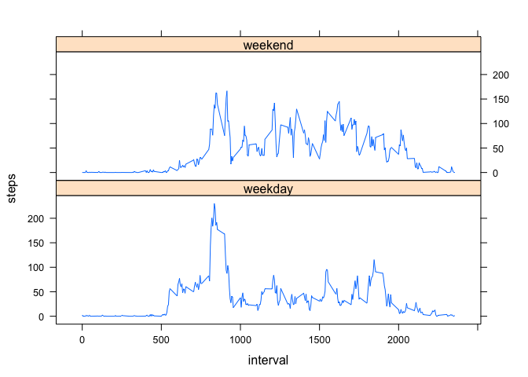

# Reproducible Research: Peer Assessment 1


## Loading and preprocessing the data
First set the working directory to the location of the file and load it in using the read.csv function

```r
setwd("/Users/dankirlin/RepData_PeerAssessment1")
file <- read.csv("activity.csv")
```


## What is mean total number of steps taken per day?
Remove the rows with NA data values, then group the data by date, summing up the stpes.
Create a histogram of the steps taken per day

```r
fileCleaned <- na.omit(file)
stepsPerDayDf <- aggregate(steps ~ date , fileCleaned, sum)
hist(stepsPerDayDf$steps, main = "Steps per day", xlab = "steps")
```

 


Report the mean and median of steps taken

```r
mean(stepsPerDayDf$steps)
```

```
## [1] 10766.19
```

```r
median(stepsPerDayDf$steps)
```

```
## [1] 10765
```

## What is the average daily activity pattern?

Line plot of the average steps in each interval over all days using the plot function and aggregate to group the data

```r
meanStepsPer5minForDayDf <- aggregate(steps ~ interval , fileCleaned, mean)
plot(meanStepsPer5minForDayDf$interval, meanStepsPer5minForDayDf$steps, type = "l")
```

 

Which 5 minute interval contains the maximum number of steps? 
Find the maximum numver of steps that occur in the data frame, then determine which interval that belongs to:
The interval is 835

```r
maxSteps <- max(meanStepsPer5minForDayDf$steps)
meanStepsPer5minForDayDf[meanStepsPer5minForDayDf$steps == maxSteps,]$interval
```

```
## [1] 835
```

## Imputing missing values
How many na values were in the original df? 

```r
sum(is.na(file$steps))
```

```
## [1] 2304
```
2304! That may be too many data points to just ignore. Replace all NAs that appear in the original file with the average steps in the given interval
Accomplish this by iterating over each row in the Df, if the step value is na, assign it the steps of the interval from the DF which contains the given average by interval.

```r
newDf <- file
for(i in 1:nrow(newDf)){
  if(is.na(newDf[i,"steps"])){
      newDf[i, "steps"] <- meanStepsPer5minForDayDf[meanStepsPer5minForDayDf$interval ==  newDf[i,"interval"],]$steps
  }
}
```

Perform the same procedure as earlier where we group by date and sum all step values for the given date then produce a histogram

```r
stepsPerDayDf2 <- aggregate(steps ~ date , newDf, sum)
hist(stepsPerDayDf2$steps, main = "Steps per day", xlab = "steps")
```

 

How much has the data actually *changed* since we made our modifications. Just from looking at the histogram it doesn't appear very different, lets look at the mean and median to give us a better idea.

```r
mean(stepsPerDayDf2$steps)
```

```
## [1] 10766.19
```

```r
median(stepsPerDayDf2$steps)
```

```
## [1] 10766.19
```
The mean is identical and the median has increased by a lousy 1.09... doesn't seem like the data is much different.

## Are there differences in activity patterns between weekdays and weekends?
Logic would state that people are more active during the weekends and more lethargic during the week (for those of us working a desk job :) ). Let's test out this theory by creating a graph of the average steps over the day, grouping by weekdays and weekends.
First we must add a variable to our dataframe indicating if the given row is a weekend or weekday.

```r
newDf$weekend <- ifelse(weekdays(as.Date(newDf$date)) == "Saturday" | weekdays(as.Date(newDf$date)) == "Sunday", "weekend", "weekday")
```

Process the data for the line graph by splitting them, getting the average for each sub piece, then combining them together.

```r
newDfWeekend <- newDf[newDf$weekend == "weekend",]
newDfWeekday <- newDf[newDf$weekend == "weekday",]
meanStepsPer5minForWeekDayDf <- aggregate(steps ~ interval , newDfWeekday, mean)
meanStepsPer5minForWeekendDf <- aggregate(steps ~ interval , newDfWeekend, mean)
meanStepsPer5minForWeekDayDf$weekend = "weekday"
meanStepsPer5minForWeekendDf$weekend = "weekend"
meanStepPer5MinByWeekdayType <- rbind(meanStepsPer5minForWeekDayDf, meanStepsPer5minForWeekendDf)
library(lattice)
xyplot(steps~interval|weekend, meanStepPer5MinByWeekdayType, type="l", layout=c(1,2))
```

 
  
  
  Aha! Our hypothesis was partially correct, it looks on average people are more active throughout the day on the weekend... however they prove to be more active during the week in the morning.
